# @i-xi-dev/ui-pointer

A `PointerActivityObserver` object observes pointer activities on a element. The observer generates a `PointerActivity` object that represents the sequence of `PointerEvent` objects with the same `pointerId`.

## Reference documentation

- [`PointerActivityObserver` class](docs/reference/classes/PointerActivityObserver-1.html)
- [`PointerActivity` interface](docs/reference/interfaces/PointerActivity-1.html)

## Usage examples

- [Panning by pointermove](docs/example/pan.html)
- [Curosr proximity detection](docs/example/proximity.html)

Examples of use with Vue.js are as follows

- [Pointer activity visualizer](docs/example/visualizer.html)
